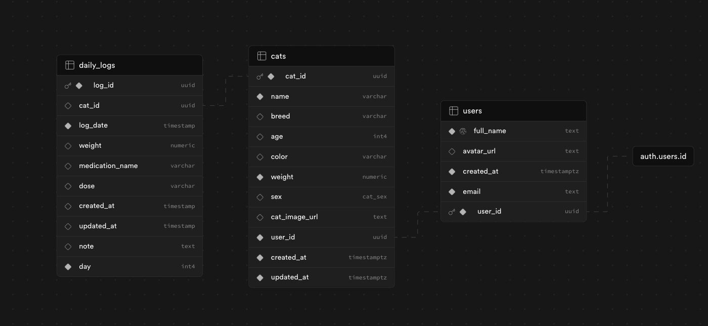

# FIP CatCare App 🐈 💉💊

## Project Description 📖

**FIP CatCare app** is a web app for tracking and managing medication schedules, daily health logs, and test results for cats undergoing treatment for FIP. For owners of FIP positive cats, in hope for fast recovery 🍀
This app helps users manage their cats' schedules, add notes and set reminders and upload test results (bloodwork, etc.).

## What is FIP?

Feline Infectious Peritonitis (FIP) is a serious viral disease that affects cats, caused by certain strains of the feline coronavirus. While many cats infected with feline coronavirus remain healthy, a small percentage of cats develop FIP, which can be fatal if left untreated.

## How Can FIP Be Treated?

FIP used to be considered untreatable, but recent advances have made treatment possible using specific antiviral medications. The treatment often involves precise dosing based on the cat’s weight, the type of FIP (wet, dry, ocular, or neurological), and the medication’s concentration.

## Planning application structure

## App requirements 📎

- Functional requirements:

  - public facing part - landing page (that will educate cats' owners what FIP is and how to treat and cure it), also can have a gallery of already cured cats 😻 - available for anonymous and authenticated users
  - user dashboard - only authenticated users
  - add cat/cats
  - based on the type of FIP, cat's weight and concentration of the medication - calculate current dosage of the medication
  - log dosage given each day (for 84 or more days)
  - add daily notes and symptoms
  - reminder for vet control and bloodwork (vet control should happen every 4 weeks during the treatment and every 4 weeks after the treatment)
  - upload test results (in format of image)
  - view history (previous logs)
  - manage multiple cats (1 owner can have many cats)

- Non-functional requirements:
  - responsive design (mobile first)
  - reliable notifications

## User stories

- [] As a user, I want to create an account and log in
- [] As a user, I want to add, view, edit, and delete cats
- [] As a user, I want to add daily logs for each cat including medication dosage and notes
- [] As a user, I want to upload and view bloodwork and test results for each cat
- [] As a user, I want to calculate the medication dosage based on the cat's weight and symptoms

## Tables and data relationships 🖇️

 (from supabase schema visualizer)
