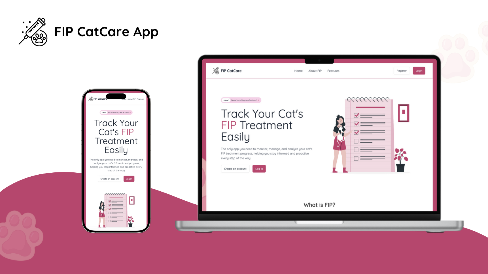

# FIP CatCare App 🐈 💉💊

_(🆕 features, ongoing updates!)_

The only app you need to monitor, manage and analyze your cat's FIP treatment progress, helping you stay informed and proactive every step of the way



## Table of Contents

- [Project Description](#project-description-)
- [Getting started](#getting-started-)
- [Installation and Setup](#installation-and-setup)
- [Contribution](#contributing)
- [Problem and how FIP CatCare app solves it](/docs/Problem.md)
- [App requirements, users stories and tables and database relationship](/docs/App-requirements.md)

## Project Description 📖

**FIP CatCare app** is a web app for tracking and managing medication schedules, daily health logs and test results for cats undergoing treatment for FIP. For owners of FIP positive cats, in hope for fast recovery 🍀
This app helps users manage their cats' schedules, add notes and set reminders and upload test results (bloodwork, etc.).

### Brief Introduction and Explanation of FIP 🦠

#### What is FIP?

Feline Infectious Peritonitis (FIP) is a serious viral disease that affects cats, caused by certain strains of the feline coronavirus. While many cats infected with feline coronavirus remain healthy, a small percentage of cats develop FIP, which can be fatal if left untreated.

#### How Can FIP Be Treated?

FIP used to be considered untreatable, but recent advances have made treatment possible using specific antiviral medications. The treatment often involves precise dosing based on the cat’s weight, the type of FIP (wet, dry, ocular, or neurological) and the medication’s concentration.

## Getting Started 💻

#### Important Notice ⚠️

**Please Note**: Some actions and features in this project are **not functional in production** because they rely on specific data or configurations that have yet to be pushed to the production database.

You have two options to get started with the **FIP CatCare App**:

1. **Use the Test Account**:

   - If you want to quickly explore the app's functionality, you can use the test account provided below:
     - **Email**: test@user.com
     - **Password**: password

   **Note**: This test account is read-only and designed for preview purposes. Any data entered or modified will not be saved permanently.

2. **Follow Installation Instructions**:
   - If you’d like to set up the app on your local machine, please follow the installation instructions below:

## Installation and Setup 🛠️

1. **Clone the repository:**

   ```bash
   git clone git@github.com:nina1012/FIP-CatCare.git
   cd FIP-CatCare
   ```

2. **Install dependencies:**

   ```bash
   npm install
   ```

3. **Set up environment variables:**

   1. **Create a `.env` file** in the root directory of your project:

      ```bash
      touch .env
      ```

   2. **Add the following variables to your `.env` file.** Replace `<YOUR_SUPABASE_URL>` and `<YOUR_SUPABASE_ANON_KEY>` with your actual Supabase credentials:

      ```bash
      VITE_SUPABASE_URL=<YOUR_SUPABASE_URL>
      VITE_SUPABASE_ANON_KEY=<YOUR_SUPABASE_ANON_KEY>
      ```

   3. **Example of how your `.env` file should look:**

      ```bash
      VITE_SUPABASE_URL=https://your-project-id.supabase.co
      VITE_SUPABASE_ANON_KEY=your_anon_key
      ```

**Note**: Ensure that your `.env` file is not shared publicly, as it contains sensitive information. Since this app is built using Vite, remember to prefix your environment variables with `VITE_`

4. **Run the development server:**

   ```bash
   npm run dev
   ```

## Contributing 💡

Contributions are always welcome to make this project better together! ✨ If you have any ideas, suggestions, or fixes, feel free to contribute. Follow the steps to get started:

1. **Fork the Repository**  
   Click the "Fork" button at the top-right corner of this repository to create your copy.
2. **Clone Your Fork**  
   Clone the forked repository to your local machine:
   ```bash
   git clone https://github.com/your-username/FIP-CatCare.git
   ```
3. Create a branch: `git checkout -b feature-name`
4. Install dependecies by running the `npm install` script.
5. Make some changes
6. Test your changes
7. Commit your changes
   ```bash
   git commit -m "Add: Description of your changes"
   ```
8. Push your branch and open a Pull Request

Thank you for contributing and helping improve this project! ❤️

### Design Inspiration 🎨

This project’s design was inspired by [FIP Oasis](https://fipoasis.com) and [Cure FIP](https://www.curefip.com/), with custom tweaks to fit my app’s functionality and style.

 (FIP CatCare App)
