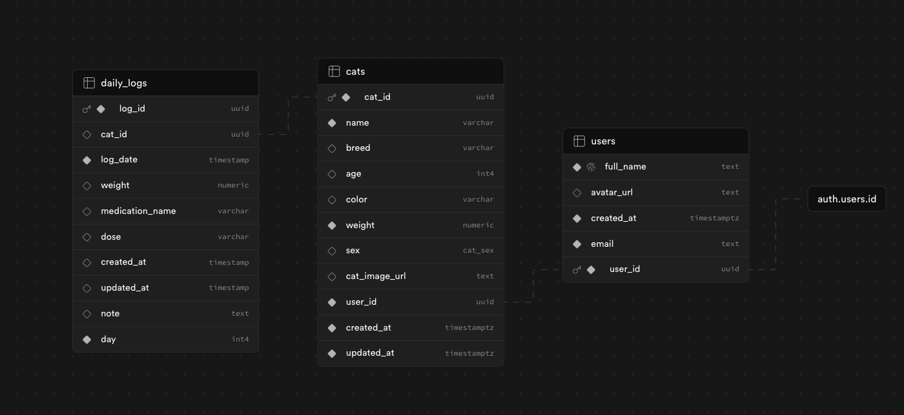

## App requirements 📎

## Requirements

- Functional requirements:

  - public facing part - landing page (that will educate cats' owners what FIP is and how to treat and cure it), also can have a gallery of already cured cats 😻 - available for anonymous and authenticated users
  - user dashboard - only authenticated users
  - add cat/cats
  - based on the type of FIP, cat's weight and concentration of the medication - calculate current dosage of the medication
  - log dosage given each day (for 84 or more days)
  - add daily notes and symptoms
  - reminder for vet control and bloodwork (vet control should happen every 4 weeks during the treatment and every 4 weeks after the treatment)
  - upload test results (in format of image)
  - view history (previous logs)
  - manage multiple cats (1 owner can have many cats)

- Non-functional requirements:

  - responsive design (mobile first)
  - reliable notifications

## Architecture / High-level design

Diagram

## User stories

- [x] As a user, I want to create an account and log in
- [x] As a user, I want to add, view, edit and delete cats
- [x] As a user, I want to add daily logs for each cat including medication dosage and notes
- [] As a user, I want to upload and view bloodwork and test results for each cat
- [x] As a user, I want to calculate the medication dosage based on the cat's weight and symptoms

## Data model : Tables and data relationships 🖇️

 (from supabase schema visualizer)

## Interface definition (API)

All endpoints can be found inside `src/features/feature-name/api` folders.
Each file in these directories contains the function that interacts with the respective endpoint, along with a React Query hook for easy data fetching and/or mutation.

## Optimizations and deep dive

- Performance:
  To optimize performance for the daily-logs-table.tsx, I utilized table with pagination from MUI. This approach ensures that only a limited number of daily logs are rendered initially, reducing the load time and improving responsiveness.

- User experience and a11y:

  For good UX/UI and accessibility, I have used shadcnUI and MUI that have built-in support for a11y and follow modern design principles.
